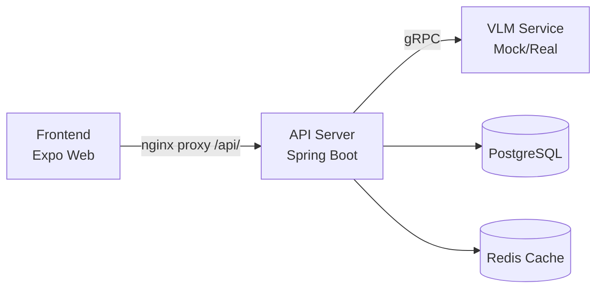

# 내 손안의 AI 폐기물 처리 도우미
[](https://github.com/deuxksy/waste-helper/actions/workflows/ci.yml)
> **waste-helper** — AI 기반 폐기물 분류 도우미

## 아키텍처



> 전체 시스템 아키텍처는 [docs/architecture.md](docs/architecture.md) 참조

## 구조

```
waste-helper/
├── api-server/          # JHipster API 서버 (Spring Boot 4.0)
├── frontend/            # 모바일/웹 프론트엔드 (Expo SDK 54)
├── mock-vlm/            # Mock VLM gRPC 서비스 (Python)
├── vlm-service/         # VLM gRPC 서비스 (Qwen3-VL-4B, GPU)
├── k8s/                 # Kubernetes 매니페스트 & Helm Chart
├── docs/                # 설계 문서
└── scripts/             # 유틸리티 스크립트
```

## 기술 스택

| Component   | Technology                                    |
|-------------|-----------------------------------------------|
| Frontend    | Expo SDK 54, React Native 0.81, NativeWind v4 |
| API Server  | Spring Boot 4.0, JHipster 9, Java 21          |
| VLM Service | Python 3.12, gRPC, Qwen3-VL-4B               |
| Database    | PostgreSQL + Redis                            |
| Infra       | Proxmox Kubernetes (OrbStack), ArgoCD         |

## 하위 프로젝트

| 프로젝트 | 설명 | 문서 |
|----------|------|------|
| Frontend | Expo Web/Native 크로스 플랫폼 앱 | [frontend/README.md](frontend/README.md) |
| API Server | Spring Boot REST API + gRPC 클라이언트 | [api-server/README.md](api-server/README.md) |
| Mock VLM | GPU 없이 테스트용 Mock gRPC 서비스 | [mock-vlm/README.md](mock-vlm/README.md) |
| VLM Service | Qwen3-VL-4B 실제 VLM 추론 서비스 | [vlm-service/README.md](vlm-service/README.md) |
| K8s | Kubernetes 배포 매니페스트 | [k8s/README.md](k8s/README.md) |

## 로컬 개발

```bash
make help          # 전체 타겟 목록
make loc-up        # 로컬 K8s 전체 스택 실행
make loc-down      # 로컬 K8s 전체 스택 중지
make loc-logs      # 로컬 로그 확인
```

### 외부 기기에서 테스트

```bash
kubectl port-forward -n waste-helper svc/frontend 33080:80 --address 0.0.0.0
kubectl port-forward -n waste-helper svc/api-server 32067:8080 --address 0.0.0.0
```

- Frontend: `http://<machine-ip>:33080`
- API Server: `http://<machine-ip>:32067`

## 문서

- [시스템 아키텍처](docs/architecture.md)
- [Backend 설계 문서](docs/superpowers/specs/2026-03-30-waste-helper-backend-design.md)
- [Frontend 설계 문서](docs/superpowers/specs/2026-04-01-frontend-design.md)
