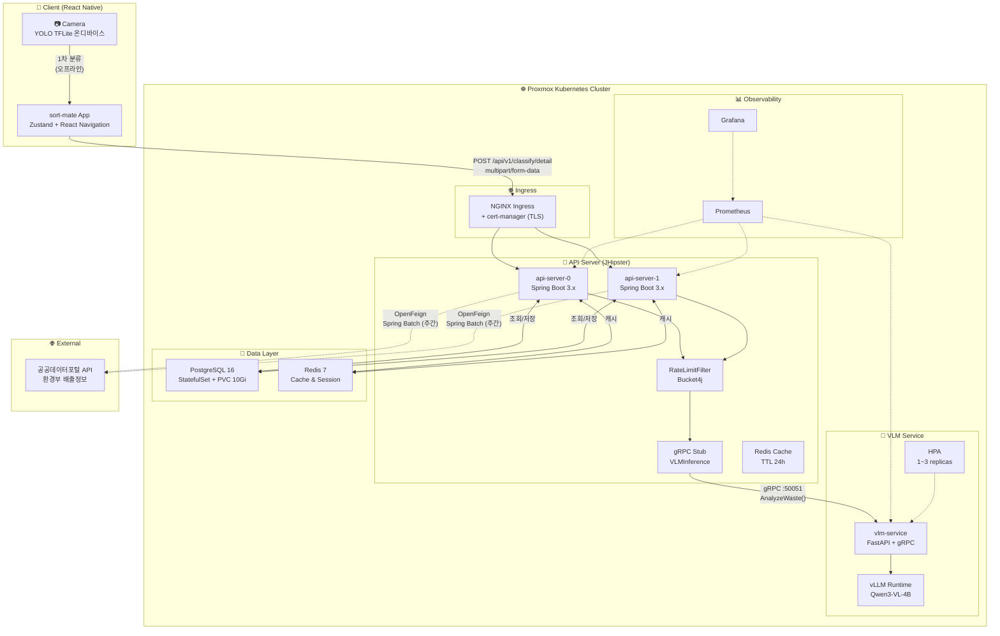
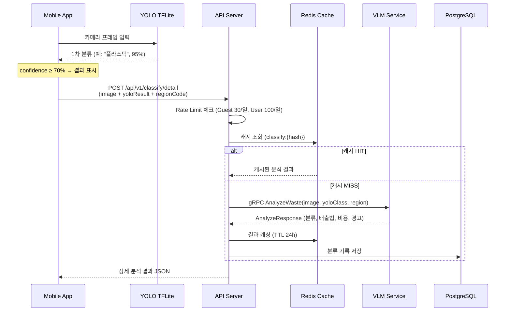
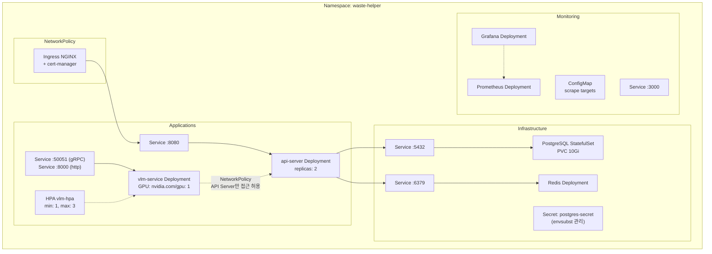
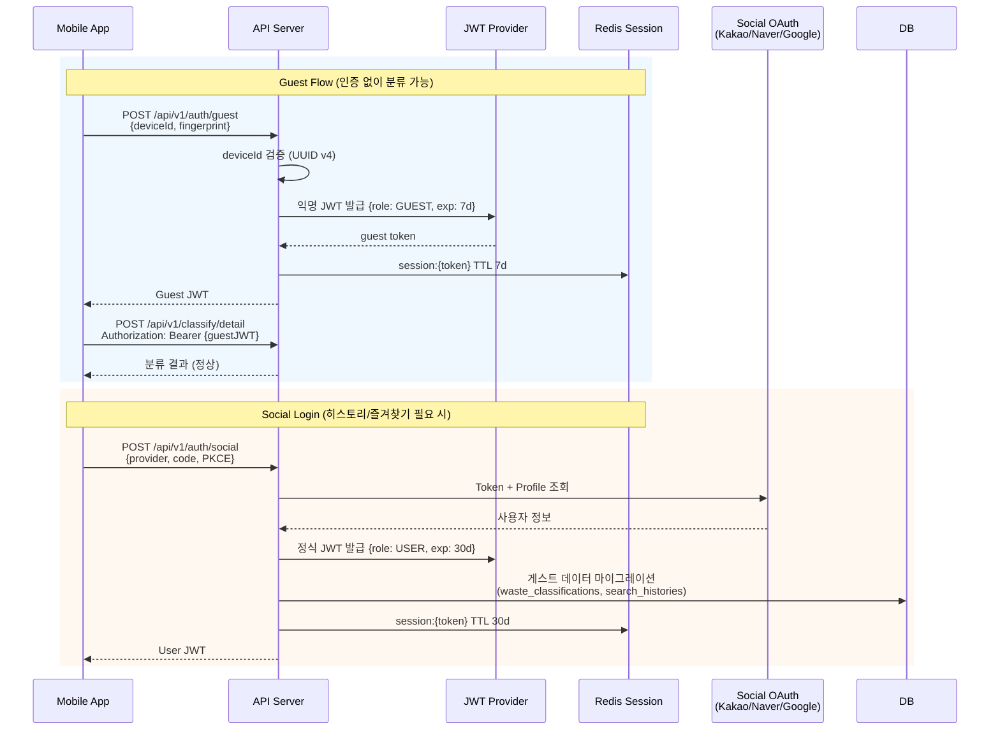
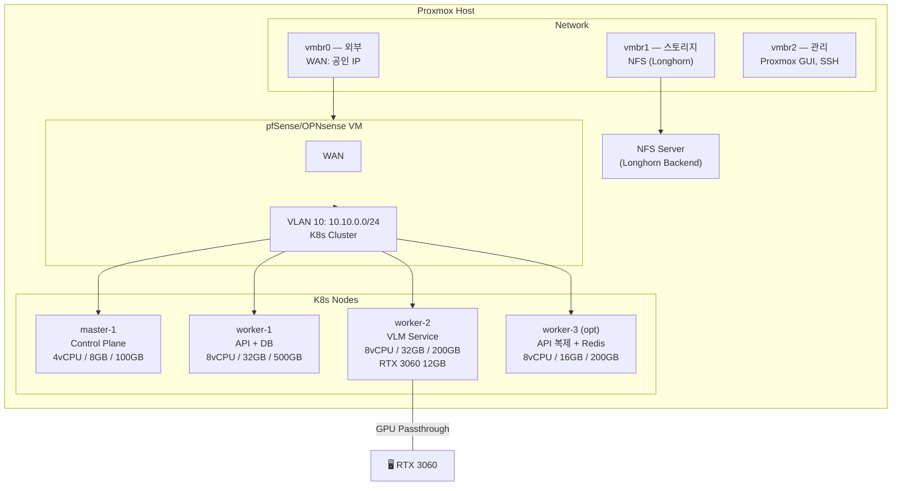

# sort-mate 시스템 아키텍처

> Phase 1 기준 — 전체 시스템 아키텍처 다이어그램

---

## 1. 전체 시스템 아키텍처



---

## 2. 분류 요청 데이터 흐름



---

## 3. K8s 네임스페이스 배포 구성



---

## 4. 인증 흐름



---

## 5. 배출 요령 조회 우선순위

```mermaid
flowchart TD
    Req["분류 결과 + 지역 코드"] --> PG{PostgreSQL<br/>공공데이터 조회}

    PG -->|"HIT"| Return1["PUBLIC_API<br/>공공데이터 그대로 반환"]
    PG -->|"MISS"| Vec{Vector DB<br/>유사 검색 (threshold 0.85)}

    Vec -->|"HIT"| Return2["VECTOR_CACHE<br/>캐시된 LLM 응답 반환"]
    Vec -->|"MISS"| VLM["VLM 실시간 추론<br/>Qwen3-VL-4B"]

    VLM --> SaveVec["임베딩 → Vector DB 저장"]
    VLM --> Return3["VLM_REALTIME<br/>VLM 응답 반환"]
    VLM --> SavePG["공공데이터 누락 필드<br/>LLM 보완 → DB 저장"]

    style Return1 fill:#4CAF50,color:#fff
    style Return2 fill:#FF9800,color:#fff
    style Return3 fill:#F44336,color:#fff
```

---

## 6. Proxmox 클러스터 노드 구성



---

## 7. GitOps 배포 흐름

```mermaid
graph LR
    Dev["Developer<br/>git push"] --> GitHub["GitHub Repo<br/>deuxksy/sort-mate"]

    subchart ArgoCD["ArgoCD"]
        Sync["Auto Sync"]
        Diff["Drift Detection"]
    end

    GitHub -->|"Webhook / Poll"| Sync
    Sync -->|"Apply Manifests"| K8s["K8s Cluster"]

    subchart Repo["/k8s Directory"]
        Manifests["/manifests/<br/>K8s raw YAML"]
        Helm["/helm/<br/>Helm Chart"]
        App["/argocd/<br/>Application CRD"]
    end

    GitHub --- Repo
    App --> Sync
    Diff -->|"Git Diff"| GitHub
```
