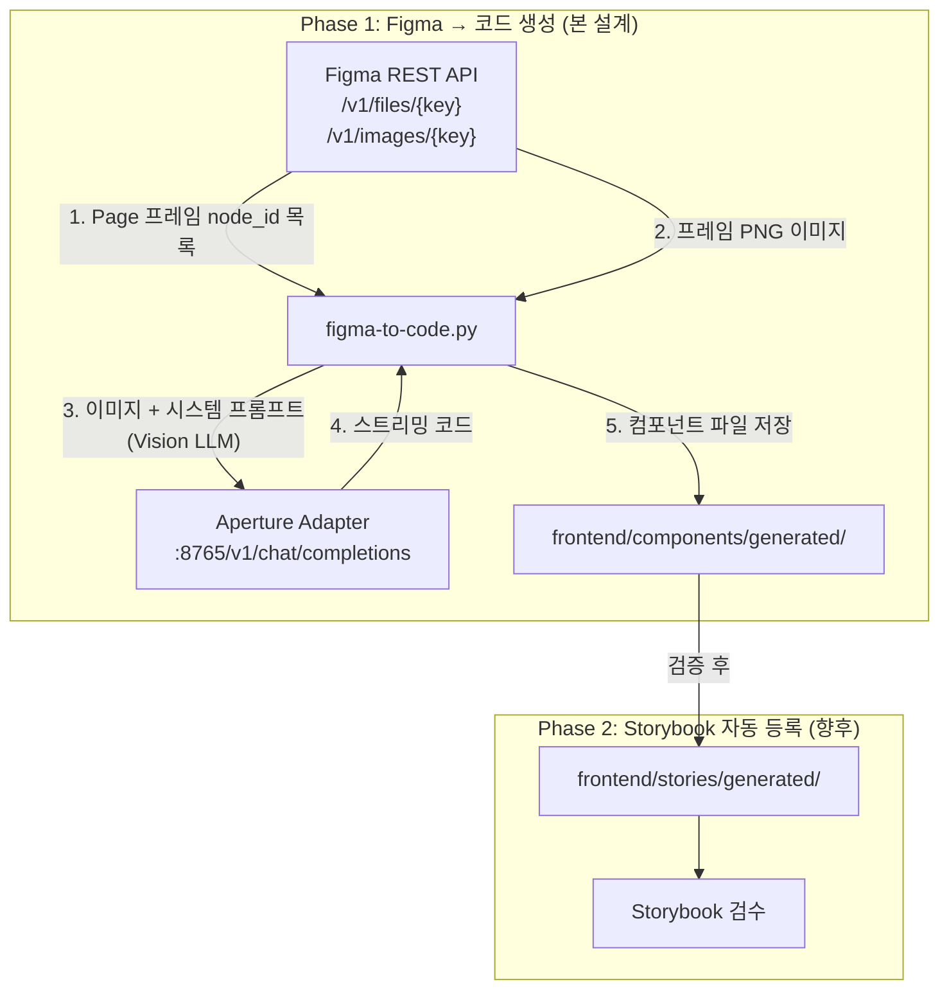
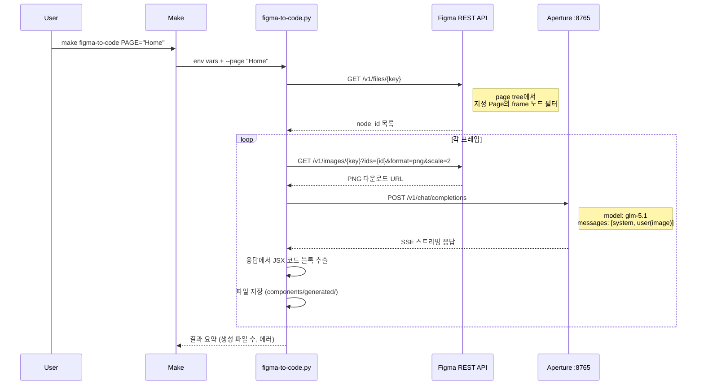

# Design Spec: Figma API → Code Generation 파이프라인

> **날짜**: 2026-04-08
> **상태**: Approved
> **프로젝트**: 내 손안의 AI 폐기물 처리 도우미
> **관련**: [UI 파이프라인 설계](2026-04-06-figma-openui-storybook-appsmith-design.md)

## TL;DR

Figma Page 단위로 프레임 이미지를 추출하여 Aperture Vision LLM에 전달, React + NativeWind 컴포넌트 코드를 자동 생성. `make figma-to-code` 하나로 Figma 시안 → 코드까지 자동화. Phase 1은 코드 생성까지, Phase 2에서 Storybook 자동 등록 확장.

## 1. 배경 및 동기

기존 UI 파이프라인(v0.3.0)은 Figma Variables → tokens → Tailwind/Appsmith 변환까지만 자동화. Figma 시안 → OpenUI → 컴포넌트 코드 생성 과정은 모두 수동:

1. OpenUI 웹 UI에 Figma URL 수동 붙여넣기
2. 생성된 코드 수동 복사
3. Storybook 스토리 수동 작성

이 과정을 API로 자동화하여 `make` 명령어 하나로 실행 가능하게 한다.

## 2. 아키텍처



### 핵심 설계 결정

| 결정 | 선택 | 이유 |
|------|------|------|
| LLM 호출 경로 | Aperture 직접 호출 | OpenUI 백엔드는 LLM 프록시 역할만, 중간 계층 불필요 |
| Figma 추출 단위 | Page | 여러 프레임 일괄 처리에 적합 |
| 트리거 | Make 명령어 | CI/CD 통합 용이, 기존 패턴 일관성 |
| 코드 타겟 | React + NativeWind | 기존 Frontend 스택과 동일 |
| Phase 1 검증 | 수동 Storybook 등록 | 안정성 확보 후 Phase 2에서 자동화 |

## 3. 데이터 흐름



### Figma API 호출 상세

| API | 목적 | 응답 |
|-----|------|------|
| `GET /v1/files/{key}` | 전체 파일 구조 조회 | document tree (pages → frames) |
| `GET /v1/images/{key}?ids=...&format=png&scale=2` | 프레임 PNG 렌더링 | `{node_id: image_url}` |

### Aperture 요청 형식

```json
{
  "model": "glm-5.1",
  "messages": [
    {
      "role": "system",
      "content": "You are a React + NativeWind component generator..."
    },
    {
      "role": "user",
      "content": [
        {"type": "image_url", "image_url": {"url": "data:image/png;base64,..."}},
        {"type": "text", "text": "Generate a React NativeWind component from this Figma frame."}
      ]
    }
  ],
  "stream": true
}
```

## 4. 산출물 구조

```
ui/scripts/
├── figma-sync.sh              # 기존: tokens 동기화
├── sd-build.sh                # 기존: Style Dictionary 빌드
└── figma-to-code.py           # 신규: Figma → 코드 생성

frontend/
├── components/
│   ├── generated/             # 신규: 자동 생성 컴포넌트
│   │   ├── HomeHeader.jsx
│   │   ├── WasteCard.jsx
│   │   └── ...
│   └── Button.jsx             # 기존: 수동 작성
└── stories/
    └── generated/             # Phase 2: 자동 생성 스토리
```

### 생성 파일 네이밍 규칙

- Figma 프레임명 → PascalCase 변환
- 예: `home-header` → `HomeHeader.jsx`
- 충돌 시 경고 출력 후 스킵

## 5. 스크립트 인터페이스

### 환경변수

| 변수 | 필수 | 기본값 | 설명 |
|------|------|--------|------|
| `FIGMA_TOKEN` | O | — | Figma Personal Access Token |
| `FIGMA_FILE_KEY` | O | — | Figma 파일 키 (URL에서 추출) |
| `APERTURE_BASE` | X | `http://localhost:8765` | Aperture API 베이스 URL |
| `APERTURE_MODEL` | X | `glm-5.1` | 사용할 Vision LLM 모델 |
| `PAGE` | X | (첫 번째 페이지) | 대상 Figma Page 이름 |

### CLI

```bash
python3 ui/scripts/figma-to-code.py --page "Home"
```

### Makefile 타겟

```makefile
figma-to-code: ## Figma Page → React/RN 컴포넌트 자동 생성
	$(call check_env,FIGMA_TOKEN)
	python3 ui/scripts/figma-to-code.py --page "$(PAGE)"
```

## 6. 시스템 프롬프트

```
You are a React + NativeWind (Tailwind CSS for React Native) component generator.

Given a Figma frame screenshot, generate a single React component that:
1. Uses NativeWind (className prop) for styling — no inline styles
2. Is TypeScript-compatible (proper prop types via JSDoc)
3. Supports common variants (size, variant, disabled) where applicable
4. Uses only standard React Native components (View, Text, TouchableOpacity, Image, ScrollView)

Output ONLY the JSX code inside a single ```jsx code block. No explanation.
```

## 7. 에러 처리

| 시나리오 | 대응 |
|----------|------|
| Figma API 403 | TOKEN 만료 안내 후 종료 |
| Figma API 404 | FILE_KEY 또는 PAGE 이름 확인 안내 |
| 프레임 없음 | "지정 Page에 프레임이 없습니다" 안내 |
| Aperture 연결 실패 | adapter 실행 상태 확인 안내 |
| Aperture 타임아웃 | 30초 타임아웃, 해당 프레임 스킵 후 계속 |
| 코드 파싱 실패 | 원본 응답을 `.raw.txt`로 저장, 경고 출력 |
| 파일 충돌 | 기존 파일 스킵, 경고 출력 |

## 8. Phase 로드맵

| Phase | 범위 | 상태 |
|-------|------|------|
| Phase 1 | Figma API → Aperture → 컴포넌트 파일 생성 | 본 설계 |
| Phase 2 | 생성 컴포넌트 → Storybook 스토리 자동 등록 | 향후 |
| Phase 3 | Storybook 시각 리그레션 테스트 | 향후 |

## 9. 의존성

- Python 3.12 (기존)
- `requests` — Figma API + Aperture 호출
- `base64` (표준 라이브러리) — 이미지 인코딩
- 추가 패키지 설치 불필요 (표준 라이브러리 + requests만 사용)

## 10. 제약사항

- Figma Pro 이상 계정 필요 (REST API 접근)
- Aperture adapter 실행 상태 필수
- Vision LLM 모델(glm-5.1) 이미지 입력 지원 필요
- 생성 코드 품질은 LLM 성능에 의존 — 수동 검증 권장
